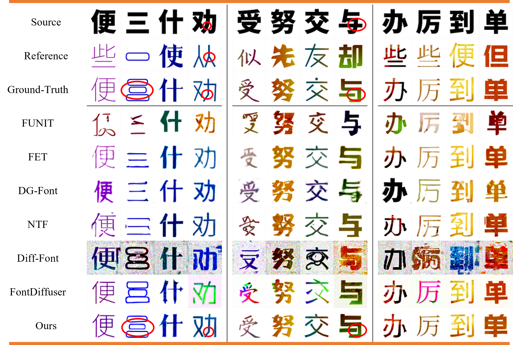
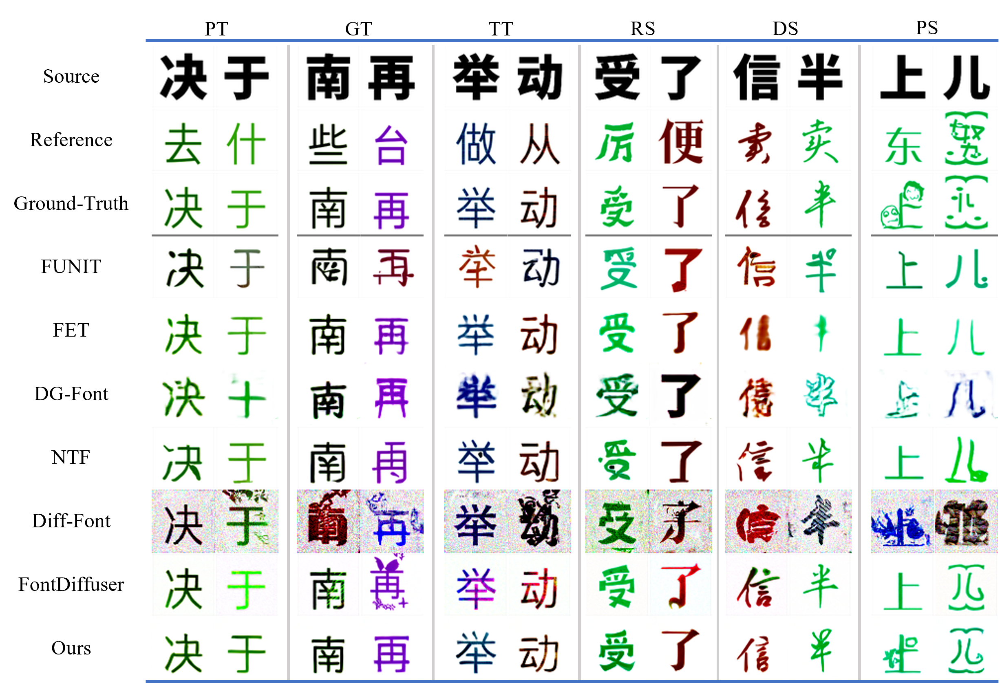
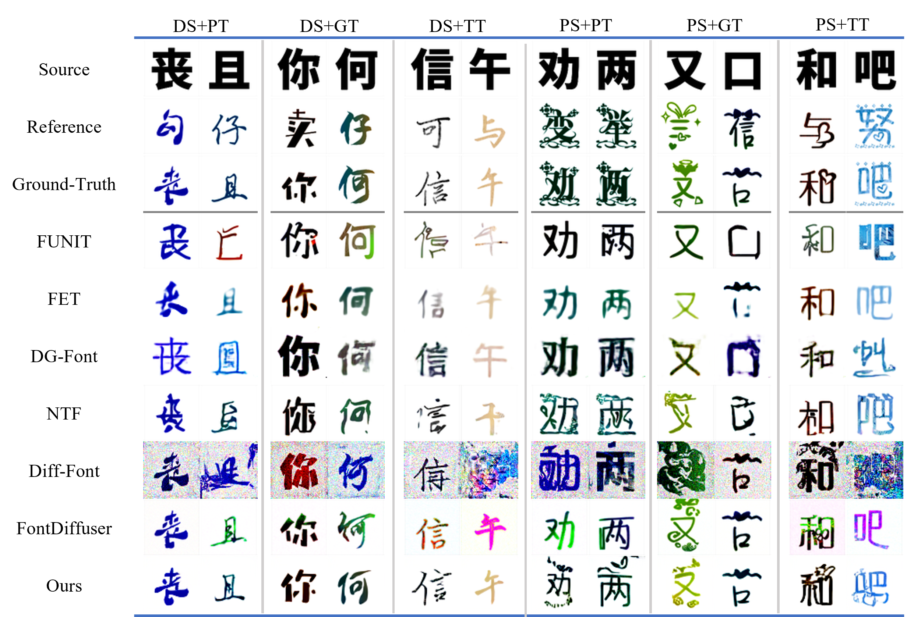
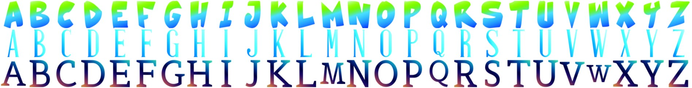
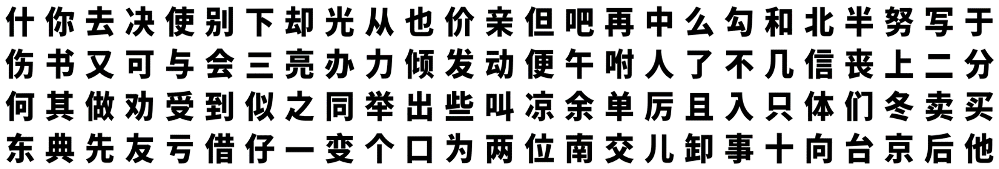
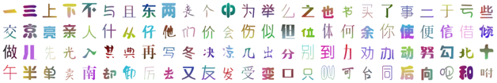

## ArtGlyphDiffuser
****
Official code implementation based on pytorch for paper, ArtGlyphDiffuser:
Text-driven Artistic Glyph Generation via Style-to-CLIP Projection and Multi-Level Controlled Diffusion.

### Highlights
****
- We propose ArtGlyphDiffuser, a novel Stable-Diffusion-based one-shot text-driven artistic glyph image generation model that achieves state-of-the-art performance in generating characters of various shapes and styles.
- To fuse cross-modal information from text and images, we introduce the innovative Style-to-CLIP Projection module, which maps the reference image onto the space that exists within the SD model itself.
- We propose a novel controllable strategy and elaborate on a Multi-Level Controlled block that seamlessly integrates information from various scales into the denoising process of the UNet network, thereby enhancing the extraction and generation of complex features.
- We utilize a Coarse-Grained Context-Consistent Loss and Randomly Masked Style strategy to fine-tune the model and demonstrate superior performance over existing methods in generating artistic glyph images across various shapes and styles.

### Gallery
****
#### Results on regular glyphs and style variations.


#### Results of testing three distinct shapes and three styles on Chinese100-Dataset independently.


#### Results of combined tests in Chinese100-Dataset. '+' is a combination of testing different components.


### TODO List
****
- [x] Add the backbone code
- [x] Opensource the dataset
- [ ] Add the code for creating the dataset
- [ ] Add checkpoints and test code
- [ ] Add webUI demo
- [ ] Push demo to Hugging Face
- [ ] Add Release Train Code

### Dependencies(Recommended)
****
- Linux
- Python 3.7.16
- Pytorch 1.13.1
- CUDA 11.1


### Environment Setup
****
**Step 1:** Clone this repo:
```bash
git clone https://github.com/Luxb0124/ArtGlyphDiffuser.git
```
**Step 2:** Create the conda environment:
```bash
conda create -n your_env_name python=3.7.16
```
**Step 3:** Activate the conda environment:
```bash
conda activate your_env_name
```
**Step 4:** Install the requirements:
```bash
pip install -r requirements.txt
```

### Datasets
****
#### MCGAN-Dataset:
The MCGAN-Dataset is the English dataset proposed by [MCGAN](https://ieeexplore.ieee.org/stamp/stamp.jsp?tp=&arnumber=8578887), which contains 32046 synthetic artistic fonts, each with 26 glyphs as shown in . These images are well-aligned with a resolution of 64x64.

The authors of MCGAN have open-sourced their code and dataset. You have the option to download from the [official source](https://github.com/azadis/MC-GAN?tab=readme-ov-file), or you can directly download the dataset that we have previously downloaded([GooleDrive](https://drive.google.com/drive/folders/1b1KfmDVZIq4LNDXiW_T5hRjHKH8mNNWf?usp=drive_link)/[BaiduYun:6jf8](https://pan.baidu.com/s/1-8lvAYtyAa9yt1yRRxbCZw?pwd=6jf8)).
#### Chinese100-Dataset:
To comprehensively evaluate the versatility and generalization of the AAGIG method, we builds a new publicly available Chinese stylistic glyph image dataset named Chinese100-Dataset. The dataset is constructed following the data processing methods in [CF-Font](https://ieeexplore.ieee.org/document/10204538) and [MCGAN](https://ieeexplore.ieee.org/stamp/stamp.jsp?tp=&arnumber=8578887) to expand the Chinese dataset. The Chinese100-Dataset is well-aligned with a resolution of 128x128 and comprises 9900 different styles, including 6900 training sets and 3000 test sets, with each style containing 100 Chinese glyphs.

Specifically, we categorize the shapes and styles of these characters into three levels each. The three Shape categories are Regular (RS), Deformed (DS), and Patterned (PS), while the three style Texture analogs consist of Pure (PT) color, Gradient (GT) color, and Textured (TT) styles. Therefore, the test set comprises 15(3+3+3x3) sub-test sets, consisting of individual tests for different items and composite tests with various shapes and styles. Each sub-test set includes 200 different stylistic glyph images.


We have open-sourced this dataset, and you can choose to download and use it from either [GoogleDrive](https://drive.google.com/drive/folders/1tvCRm0El0IkIHVvZG8KrzwWFmTD5HejD?usp=sharing) or [BaiduYun:x6em](https://pan.baidu.com/s/1jg96Qryktlzc1xYFQ6qgnA?pwd=x6em).

#### Customized Dataset:
The training data files tree should be:
```
├── dataset_name
│   └── train
│       ├── style_01
│       │   ├── char_01.png
│       │   ├── char_02.png
│       │   ├── char_03.png
│       │   └── ...
│       ├── style_02
│       │   ├── char_01.png
│       │   ├── char_02.png
│       │   ├── char_03.png
│       │   └── ...
│       ├── ...
```
In addition, we have collected over 1,000 sets of TTF files for fonts from the internet, which you can download from either [GoogleDrive](https://drive.google.com/drive/folders/1Iga5nzMIZxRB2XnWQHgOkEnP-XNkApoT?usp=sharing) or [BaiduYun:8ugq](https://pan.baidu.com/s/1TRM7JePywBD7dh8amQ6goA?pwd=8ugq). To promote the development of the AAGIG community, the code used for creating the dataset will soon be open-sourced...

### How to run?
****
**Step 1**: Add the current directory to `PYTHONPATH`:
```bash
export CURDIR="./"
export PYTHONPATH=$CURDIR:$PYTHONPATH
```
**Step 2**: Activate your conda enviroment:
```bash
conda activate your_env_name
```
**Step 3**: Configure the yaml file for training (You can refer to [here](demos/train.yaml) for reference):
```yaml
...
# the resolution of the image
image_size: 128
# control net
only_mid_control: True
# unet control
unet_stage_trainable: False
# vision embedding control
vision_stage_trainable: True
# learning rate
learning_rate: 1e-5
# diffuse loss weight
l_simple_weight: 1.0
# Coarse-Grained Context-Consistent loss weight
l_context: 0.2
...
```
**Step 4**: Configure the py file for training (You can refer to [here](./demos/cfg_py.py) for reference):
```python
# GPU ids
gpi_id = '0'
# the yaml configuration file 
model_yaml_path = 'train.yaml'
# how long to save the images
every_n_train_steps = 2000
# how long to print the loss
logger_freq = 200
# log dir
log_root = os.path.join(current_directory, '../../results')
# dataset dir
data_root = os.path.join(current_directory, '../../datasets/font_datasets/SEPARATE/chinese_100/train')
# initialization model path
resume_path = '../ArtGlyphDiffuser/NMCM/nmcm_init.ckpt'
# checkpoint file path
dst_dir = os.path.join(log_dir, 'checkpoints')
```
Step 5: Train the model
```bash
python ./demos/train.py
```
Step 6: Test the model
```bash
python ./demos/test.py
```
Before you test the model, you should modify some settings as follows:
```python
# Path to the trained model
ckpt_path = '../../ArtGlyphDiffuser/NMCM/10-epoch.ckpt'
# Path to the test dataset
test_dir = '../../datasets/font_datasets/SEPARATE/chinese_100/test/01_test_only_gradient'
# Path to the generated images
saved_dir = './teeeest_dir/'
```
### Acknowledgement
****
- [MCGAN](https://github.com/azadis/MC-GAN?tab=readme-ov-file)
- [CF-Net](https://github.com/wangchi95/CF-Font)
- [ControlNet](https://github.com/lllyasviel/ControlNet)

### Copyright
****
- This repository can only be used for non-commercial research purposes.
- The Chinese100 Dataset can only be used for non-commercial research purposes.
- The font files can only be used for non-commercial research purposes.
- You are encouraged to submit issues, contribute pull requests.

### Citation
****
If you use this code or the provided dataset for your research, please cite our paper:
```commandline
Coming Soon ...
```
